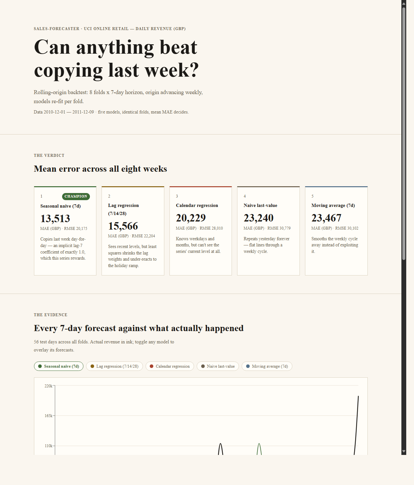

# sales-forecaster

[](https://github.com/ctrl-kinge/sales-forecaster/actions/workflows/ci.yml)

Supermarket sales forecasting — from raw retail transactions to a deployed
forecast dashboard. Research groundwork lives in
[data-science-notebooks](https://github.com/ctrl-kinge/data-science-notebooks)
(notebook 01: Online Retail EDA · notebook 02: seasonality deep-dive,
which designed the rolling-origin protocol used below).

## Roadmap

- [x] **Phase 1 — Data layer:** cached UCI Online Retail download, invoice-level
  cleaning, daily revenue aggregation (tested)
- [x] **Phase 2 — Models:** evaluation harness (single holdout +
  rolling-origin backtest), baselines, calendar/lag regressions —
  seasonal-naive survives as champion (see Results)
- [x] **Phase 3 — Dashboard:** Next.js/TypeScript scroll-story of the
  backtest — leaderboard, forecast-vs-actual chart, per-fold explorer
  (see Dashboard)
- [ ] **Phase 4 — Ship it:** CI (done early), Docker, live deployment

## Results

### Rolling-origin backtest — 8 folds × 7-day horizon (the headline)

The operationally realistic protocol (`python -m forecaster`): re-fit
weekly, forecast one week out, average scores over 8 consecutive weekly
folds so no single odd window decides the leaderboard. At a 7-day
horizon, lag-7 is a legal feature — the fair fight the single-holdout
setup never allowed.

| Model | MAE (GBP) | RMSE (GBP) |
|-------|----------:|-----------:|
| **seasonal naive (7d)** | **13,513** | **20,175** |
| regression (dow + lag-7/14/28) | 15,566 | 22,204 |
| regression (calendar features) | 20,229 | 28,010 |
| naive last-value | 23,240 | 30,779 |
| moving average (7d) | 23,467 | 30,102 |

**Seasonal-naive survives Phase 2.** Even with lag-7 legal, the lag
regression loses — and the fitted coefficients explain why: OLS puts
only ~0.45 on lag-7 (least-squares shrinks noisy predictors toward the
mean), so the model systematically under-reacts to last week's level
during the Nov–Dec ramp. Seasonal-naive implicitly bets a coefficient
of exactly 1.0 per weekday, and on this series that bold bet is right.
Adding more history helps (lag-7 alone: 18,213; lag-7/14/28: 15,566)
but a linear model can't shrink less without overfitting elsewhere.

Verdict after five models: on one year of strongly weekly-cyclic data
with a structural holiday ramp, *copy last week* is genuinely hard to
beat with linear methods. Beating it likely needs models that handle
trend and seasonality jointly (Prophet-style decomposition or gradient
boosting) — exactly what the dashboard phase will visualize.

### Single 28-day holdout (legacy protocol, Phases 2a–2c)

| Model | MAE (GBP) | RMSE (GBP) |
|-------|----------:|-----------:|
| naive last-value | 25,657 | 39,416 |
| moving average (7d) | 25,737 | 39,453 |
| **seasonal naive (7d)** | **15,185** | **30,915** |
| regression (calendar features) | 39,071 | 63,060 |
| regression (dow + lag-28/35) | 23,609 | 38,897 |

Findings preserved from earlier phases: calendar features alone lose
badly because month dummies absorb the holiday ramp and force the trend
coefficient negative (−149/day), and they can't see the series' current
level at all. Horizon-safe lags (≥ 28 days at this horizon) closed most
of that gap but were too stale to win — the freshness problem that
motivated the rolling-origin protocol above.

## Dashboard

A Next.js/TypeScript reading of the backtest, in `dashboard/`. It tells
the Phase 2 story as a single scroll: the leaderboard verdict, the
56-day forecast-vs-actual chart, and a per-fold explorer where you pick
a week and see who won it.



Data is a static export from the Python package — no API, no server:

```powershell
python -m forecaster.export          # regenerates dashboard/data/*.json
cd dashboard
npm install
npm run dev                          # http://localhost:3000
npm run test                         # vitest on the chart transforms
```

The JSON contract in `dashboard/lib/types.ts` mirrors
`forecaster/export.py`; charts are Recharts, styled in the same warm
"lab-notebook" palette as the analysis.

Or run the whole thing as a container (multi-stage build → standalone
Next server, non-root, ~150 MB):

```bash
docker build -t forecaster-dashboard ./dashboard
docker run -p 3000:3000 forecaster-dashboard   # http://localhost:3000
```

CI builds this image and smoke-tests it on every push. Live public
deployment is the remaining Phase 4 step.

## Setup

```powershell
py -m venv .venv
.venv\Scripts\python -m pip install -r requirements.txt
```

## Usage

```python
from forecaster.data import load_raw
from forecaster.prep import clean_sales, daily_revenue

series = daily_revenue(clean_sales(load_raw()))  # downloads on first call
```

## Tests

```powershell
pytest tests/ -v
```
